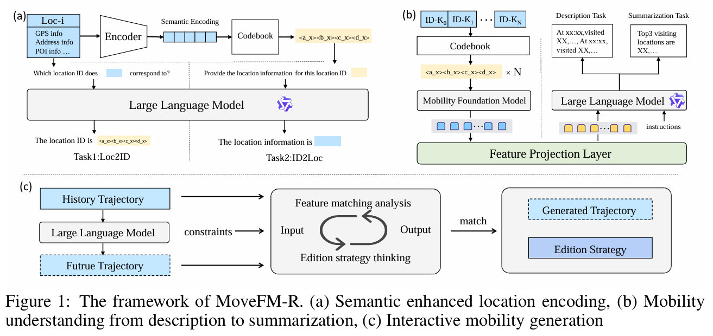

# MoveFM-R: Comprehensive Mobility Modeling with MFMs and LLMs

## 📝 Overview

This repository contains the implementation of **MoveFM-R**, a novel framework that combines the statistical modeling capabilities of Mobility Foundation Models (MFMs) with the powerful semantic reasoning of Large Language Models (LLMs), enabling more comprehensive mobility modeling.



## 🛠️ Installation

**Prerequisite**: Our code is based on LLaVA. Please execute the following code in sequence to import the required environment packages for MoveFM-R.

```bash
cd code/LLaVA-main
pip install -e .
pip install -e ".[train]"
pip install flash-attn --no-build-isolation
```

## 🚀 Pipeline-Train

### Stage 1: Semantic Enhanced Location Encoding

```bash
bash code/scripts/stage1_loc_codebook.sh
```

### Stage 2: Mobility Understanding from Description to Summarization

```bash
bash code/scripts/stage2_understand.sh
```

### Stage 3: Interactive Mobility Generation

```bash
bash code/scripts/stage3_grpo.sh
```

## 📊 Evaluation

```bash
bash code/scripts/eval.sh
```
